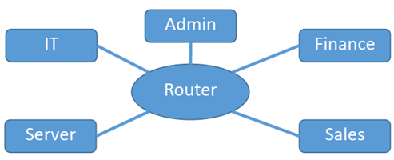
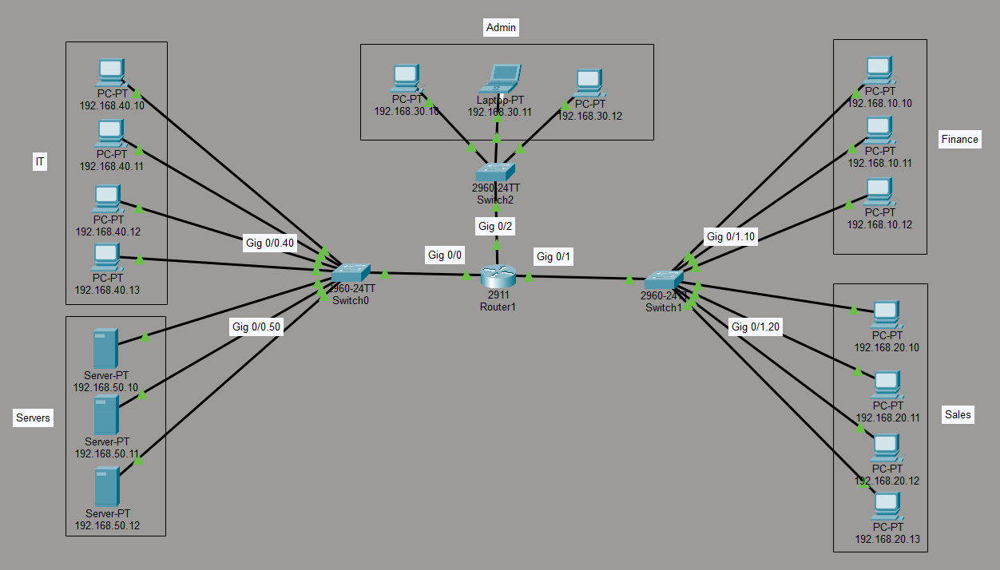
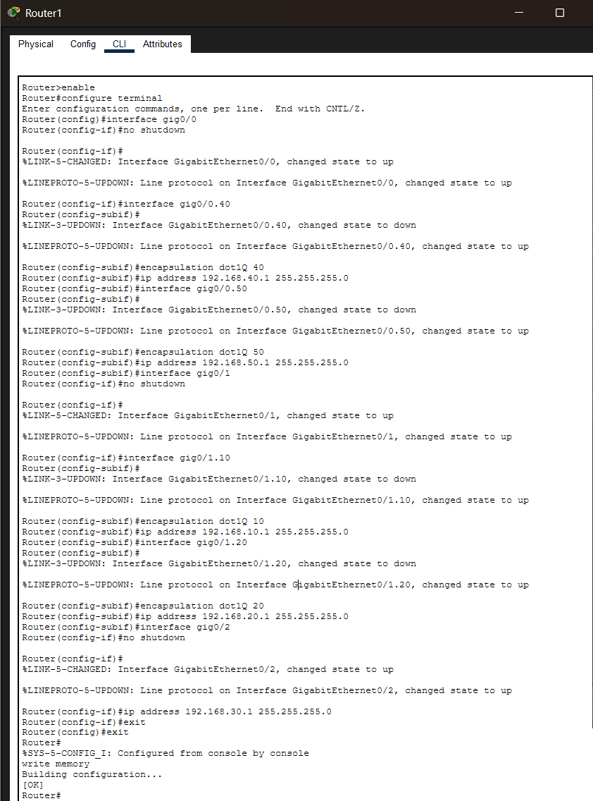
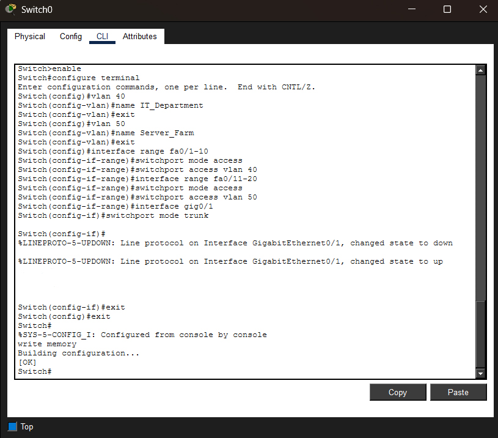
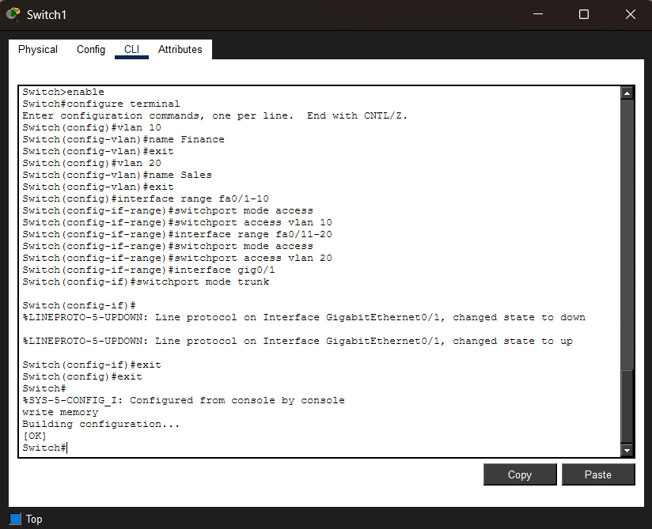
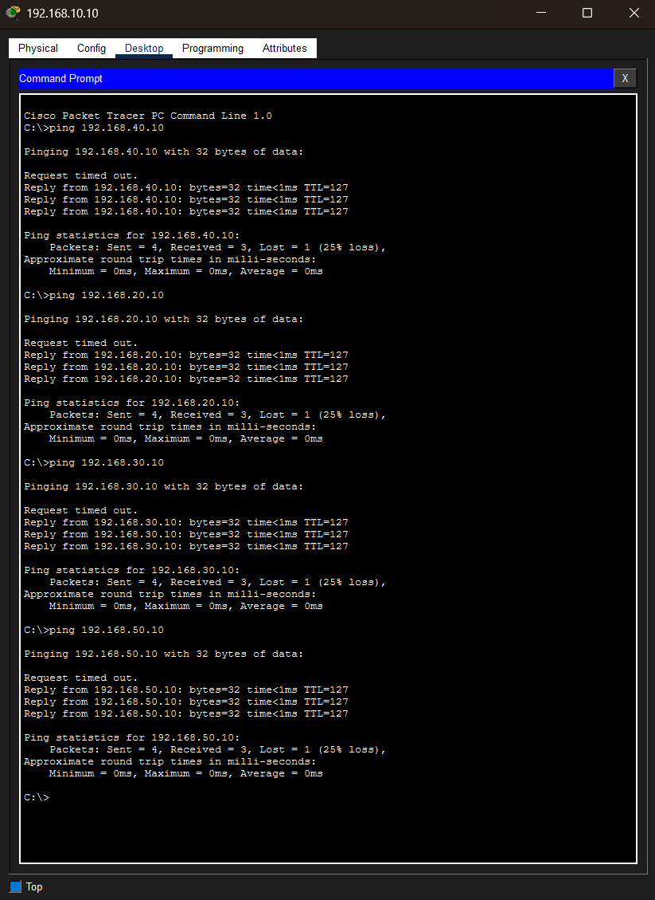

# Design & Simulate a Multi-Network Infrastructure

## 🌟 Part 1: Network Design & IP Addressing Plan

### 1.1 Project Overview
This project focuses on designing and implementing a structured network for a **Food Distribution Company**. The network is designed to ensure high availability, security, and efficient data flow between different departments. The infrastructure is divided into five distinct subnets to manage traffic and enhance security policies.

### 1.2 Departmental Breakdown
The company’s operations are organized into the following functional areas:
- **Finance:** Handles sensitive accounting data and payroll.
- **Sales:** Manages high-volume customer orders and transactions.
- **Admin:** Supports general corporate operations and human resources.
- **IT:** Dedicated to network management and technical support.
- **Servers:** A centralized area hosting essential services like HTTP (Web) and DNS.

### 1.3 IP Addressing Table
The following table outlines the **IPv4** addressing scheme used for the project:
| Department (VLAN) | Network Address | Subnet Mask | Default Gateway |
| :--- | :--- | :--- | :--- |
| Finance | 192.168.10.0 | 255.255.255.0 | 192.168.10.1 |
| Sales | 192.168.20.0 | 255.255.255.0 | 192.168.20.1 |
| Admin | 192.168.30.0 | 255.255.255.0 | 192.168.30.1 |
| IT | 192.168.40.0 | 255.255.255.0 | 192.168.40.1 |
| Servers | 192.168.50.0 | 255.255.255.0 | 192.168.40.1 |

### 1.4 Network Diagram
The proposed network topology is designed using a **Star-Hierarchical** approach. In this design, a central **Cisco 2911 Router** serves as the core of the infrastructure, interconnecting three primary directions (Top, Left, and Right). Each direction is managed by a switch that supports one or more departments through logical segmentation.



### 1.5 Design Justification
- **Easy to Expand (Scalability):** Using separate switches for each side makes it easy to add more computers in the future without disturbing the rest of the network.
- **Better Organization (Logical Segmentation):** We used "Sub-interfaces" on the router to keep departments like Finance private and safe from general traffic, while still allowing them to talk to other units when needed.
- **Smart Use of Tools (Resource Efficiency):** This design uses the router’s high-speed ports effectively to make sure everyone can access the Server Farm quickly and without delay.

---
## 🌟 Part 2 – Network Implementation

### 2.1 Building the Topology
The physical network was constructed in **Cisco Packet Tracer** using a **Cisco 2911 Router** and three **Cisco 2960 Switches**. The organization is divided into five logical units: **Admin, IT, Servers, Finance, and Sales**. Each unit is connected to the central router to ensure a structured star topology.



### 2.2 Assigning IP Addresses
Following the predefined addressing plan, static IP addresses and Subnet Masks were assigned to all end-devices. Each PC and Server was configured with its specific **Default Gateway** (the router’s sub-interface IP) to allow communication outside its own network.

### 2.3 Router Interface Configuration
The router was configured to handle multiple networks through a single physical port using the Router-on-a-Stick method.
- **Encapsulation:** 802.1Q protocol was used to distinguish between different VLANs.
- **Sub-interfaces:** Separate virtual interfaces were created (e.g., G0/1.10, G0/1.20) to act as gateways for each department.

```
enable
configure terminal
interface gig0/0
no shutdown
interface gig0/0.40
encapsulation dot1Q 40
ip address 192.168.40.1 255.255.255.0
interface gig0/0.50
encapsulation dot1Q 50
ip address 192.168.50.1 255.255.255.0
interface gig0/1
no shutdown
interface gig0/1.10
encapsulation dot1Q 10
ip address 192.168.10.1 255.255.255.0
interface gig0/1.20
encapsulation dot1Q 20
ip address 192.168.20.1 255.255.255.0
interface gig0/2
no shutdown
ip address 192.168.30.1 255.255.255.0
exit
exit
write memory
```



### 2.4 Switch Configuration (Left and Right)
The switches were configured to support logical separation using VLANs.
- **VLAN Creation:** VLANs 10, 20, 40, and 50 were created and named according to the departments.
- **Access Ports:** Specific ports were assigned to each VLAN to keep department traffic isolated.
- **Trunk Ports:** The ports connecting the switches to the router were set to Trunk Mode to allow all VLAN traffic to pass through.

**🔗 Left Switch**
```
enable
configure terminal
vlan 40
name IT_Department
exit
vlan 50
name Server_Farm
exit
interface range fa0/1-10
switchport mode access
switchport access vlan 40
interface range fa0/11-20
switchport mode access
switchport access vlan 50
interface gig0/1
switchport mode trunk
exit
exit
write memory
```


**🔗 Right Switch**
```
enable
configure terminal
vlan 10
name Finance
exit
vlan 20
name Sales
exit
interface range fa0/1-10
switchport mode access
switchport access vlan 10
interface range fa0/11-20
switchport mode access
switchport access vlan 20
interface gig0/1
switchport mode trunk
exit
exit
write memory
```


### 2.5 Connectivity Testing (Ping Results)
To verify the implementation, extensive connectivity tests were performed using the ICMP (Ping) command. Successful pings from the Finance PC (192.168.10.10) to other networks confirmed that the router is correctly routing traffic between all five departments.
- Ping to IT: Successful
- Ping to Sales: Successful
- Ping to Admin: Successful
- Ping to Servers: Successful



## 🌟 Part 3 – Protocol & Communication Analysis
### 3.1 Role of the Router
In our Food Distribution Company network, the Cisco 2911 Router acts as the central brain. Its main role is to connect different local networks (VLANs) that cannot talk to each other directly. It manages the flow of data and ensures that a packet from the Finance department reaches the correct Server in the server farm.

### 3.2 Purpose of the Default Gateway
The Default Gateway is the "exit door" for every computer in our network. Each department has its own gateway IP (e.g., 192.168.10.1 for Finance). When a PC wants to send data to a different department, it sends the data to this gateway. Without it, devices could only communicate with others in the same room (same VLAN).

### 3.3 How Routing Works (TCP vs. UDP)
Routing is the process of finding the best path for data.
- TCP (Transmission Control Protocol): It is reliable and ensures data arrives correctly. For example, when an IT staff member accesses a database on the Server, TCP is used. It creates a "handshake" to make sure the server is ready before sending the data.
- UDP (User Datagram Protocol): It is faster but doesn't check if data arrived. It is used for things like live video streaming where speed is more important than 100% accuracy.
- In our design: We primarily use TCP for department-to-server communication to ensure no data is lost during financial or administrative tasks.

### 3.4 Application Protocols Examples
In our company scenario, we use several protocols to handle daily tasks:
- HTTP / HTTPS: Used by employees to browse the company’s internal website (the web portal for food orders).
- DNS (Domain Name System): Translates names like www.food-dist.com into the Server's IP address, so users don't have to memorize numbers.
- DHCP (Dynamic Host Configuration Protocol): Automatically gives IP addresses to new PCs added to the Sales or Finance departments.
- FTP (File Transfer Protocol): Used by the IT department to upload large firmware updates or backup files to the Main Server.
- Email (SMTP/POP3): Allows the Admin department to send official notices and invoices to other units.

### 3.5 Server Services Implementation
To demonstrate the practical use of the network, we configured the central Server to provide web and naming services. The following steps were performed:
#### 🗂️ Step 1: Server IP Configuration (Prerequisite)
Before enabling services, the Server was configured with a static IP address to ensure it remains reachable by all departments.
- IP Address: 192.168.50.10
- Subnet Mask: 255.255.255.0
- Default Gateway: 192.168.50.1 (Router’s sub-interface for the Server Farm)
- DNS Server: 192.168.50.10 (The server points to itself for DNS resolution)

